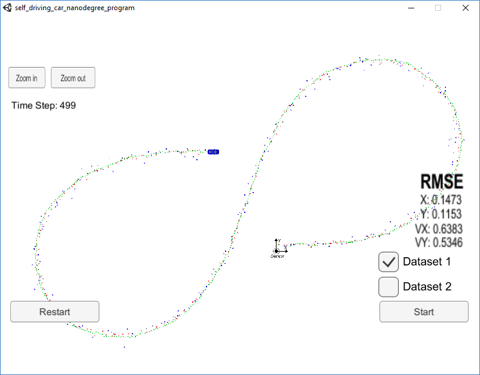

# Extended Kalman Filter Project Starter Code
Self-Driving Car Engineer Nanodegree Program

In this project I used a kalman filter to estimate the state of a moving object of interest with noisy lidar and radar measurements. Passing the project required obtaining RMSE values that are lower that the tolerance outlined in the [project rubric](https://review.udacity.com/#!/rubrics/748/view):
"Your px, py, vx, and vy RMSE should be less than or equal to the values [.11, .11, 0.52, 0.52]" 

The project starting code can be found [here](https://github.com/udacity/CarND-Extended-Kalman-Filter-Project)

In order to test it, this project must use the Term 2 Simulator which can be downloaded [here](https://github.com/udacity/self-driving-car-sim/releases)

The main program can be built and run by doing the following from the project top directory.

1. mkdir build
2. cd build
3. cmake ..
4. make
5. ./ExtendedKF

The code files that have been updated were:
* FusionEKF.cpp
* kalman_filter.cpp
* tools.cpp

Here is the main protocol that main.cpp uses for uWebSocketIO in communicating with the simulator.

INPUT: values provided by the simulator to the c++ program

["sensor_measurement"] => the measurement that the simulator observed (either lidar or radar)

OUTPUT: values provided by the c++ program to the simulator

["estimate_x"] <= kalman filter estimated position x
["estimate_y"] <= kalman filter estimated position y
["rmse_x"]
["rmse_y"]
["rmse_vx"]
["rmse_vy"]

---
Results: 

Using dataset 1 with just Lidar:

Using dataset 1 with just Radar:

Using dataset 1 with both Lidar and Radar:

Using dataset 2 with both Lidar and Radar:

Troubles found and their solution to complete the project:
1. Setting up the environment on my windows 10 was my first headache until I managed to compile and test on the simulator the given code.
2. Updating the code is almost the easiest part since most of it has been provided on the lessons, so it is just a matter of bringing all the peaces together.
3. Getting a clean line and values inside the acceptable range. We are here talking about small details that make a huge difference. As usual, those are the trikiest to get rid off.
What I got was a green line that just went crazy after the first curve that recovered somehow on the right one, but not enough to get good values
Following recommendations from the forum, I went on normalizing the angle, but that was not enough. The crazy behavior was still there, and on the right curve instead of predicting inside the measurments, it was predicting on the outside. Strangely, in both tests, the prediction touched the measurements on the left most position of the path.
Based on some inputs from the forum, I understood that the predictions were like mirrored. That was happening due to the atan function being unable to deerenciate results between 1st and 3rd quadrant, and between 2nd and 4th. So replacing that funciotn with atan2 was enough to solve the issue and get the results that I needed. Please pay attention that atan only takes one parameter (the ratio between sin and cos) when atan2 takes two (sin and cos).

